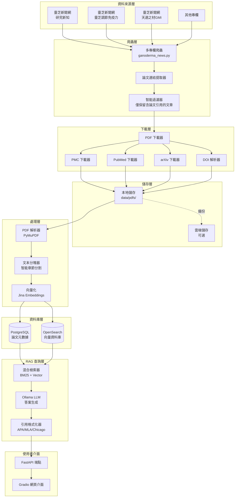
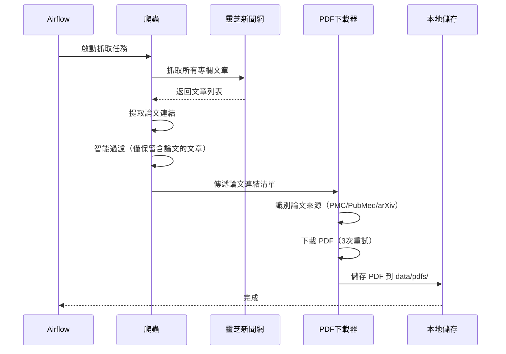
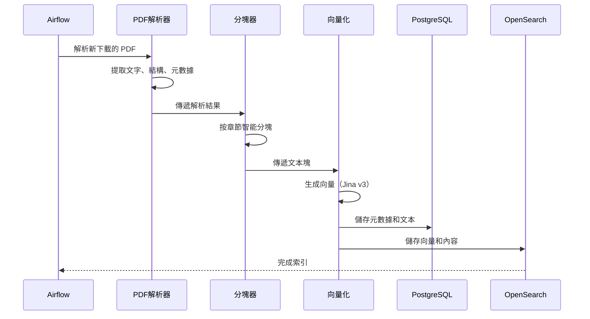
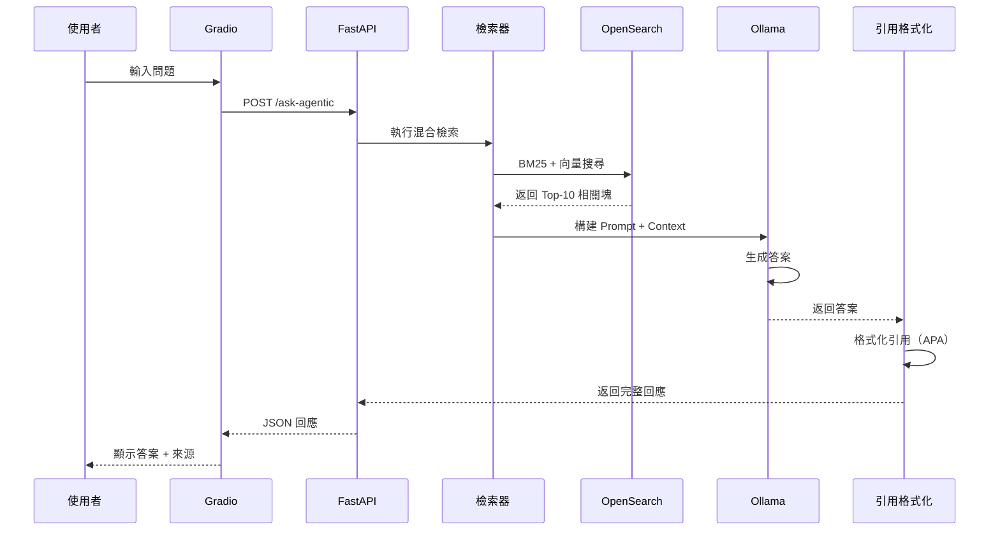

# Ganoderma Papers RAG 系統架構總覽

## 🎯 系統目標

建立一個智能的靈芝學術論文 RAG 系統，能夠：
- ✅ 自動抓取靈芝新聞網**所有專欄**的學術論文
- ✅ 下載並解析 PDF 文件
- ✅ 提供專業的文獻引用查詢服務

---

## 📊 資料來源覆蓋

### 靈芝新聞網專欄列表

| 專欄名稱 | 內容類型 | 預估文章數 | 論文引用率 |
|---------|---------|-----------|-----------|
| 🔬 **研究新知** | 最新學術研究 | 150-200 | 95% |
| 🛡️ **靈芝調節免疫力** | 免疫相關研究 | 50-80 | 80% |
| 🧬 **天選之材GMI** | GMI 蛋白研究 | 30-50 | 90% |
| 📰 **靈芝新聞** | 產業新聞 | 100-150 | 20% |
| 👥 **靈芝與我** | 使用者故事 | 50-80 | 10% |
| 📅 **活動報導** | 活動報導 | 40-60 | 5% |
| 📚 **歷史回顧** | 歷史文獻 | 30-50 | 60% |

**總計**：約 450-670 篇文章，其中約 **300-400 篇包含學術論文引用**

---

## 🏗️ 系統架構圖



---

## 💾 儲存空間規劃

### 詳細估算

#### 1. PDF 檔案儲存
```
假設：
- 總文章數：450-670 篇
- 含論文引用：300-400 篇（約 60%）
- 成功下載 PDF：200-300 篇（約 70%）
- 平均 PDF 大小：3 MB

計算：
300 篇 × 3 MB = 900 MB ≈ 1 GB
```

#### 2. 資料庫儲存
```
PostgreSQL：
- 論文元數據：300 篇 × 50 KB = 15 MB
- 文本塊：300 篇 × 8 塊 × 20 KB = 48 MB
- 索引和其他：約 50 MB
總計：約 113 MB ≈ 120 MB
```

#### 3. 向量資料庫
```
OpenSearch：
- 向量數據：2,400 塊 × 1024 維 × 4 bytes = 9.8 MB
- 文本內容：2,400 塊 × 20 KB = 48 MB
- 索引結構：約 200 MB
總計：約 258 MB ≈ 300 MB
```

#### 4. Docker 容器
```
- PostgreSQL 映像：約 400 MB
- OpenSearch 映像：約 800 MB
- Redis 映像：約 50 MB
- Ollama + 模型：約 5 GB
- 應用程式映像：約 500 MB
總計：約 6.75 GB
```

### 📦 總儲存需求

| 項目 | 大小 | 說明 |
|------|------|------|
| PDF 檔案 | 1 GB | 論文原文 |
| PostgreSQL | 120 MB | 元數據和文本 |
| OpenSearch | 300 MB | 向量和索引 |
| Docker 容器 | 6.75 GB | 系統映像 |
| **總計** | **約 8.2 GB** | **完整系統** |

> [!NOTE]
> **實際使用建議**
> - 💻 **本地開發**：8-10 GB 硬碟空間即可
> - 🚀 **生產環境**：建議預留 15-20 GB（含日誌和備份）
> - ☁️ **雲端儲存**：目前不需要，本地儲存完全足夠

---

## 🔄 資料處理流程

### 階段 1：資料擷取（每週執行）



### 階段 2：資料處理（接續執行）



### 階段 3：使用者查詢（即時）



---

## 🎨 使用者介面預覽

### Gradio 介面功能

```
┌─────────────────────────────────────────────────────────┐
│  🍄 靈芝學術論文智能問答系統                              │
├─────────────────────────────────────────────────────────┤
│                                                         │
│  📝 請輸入您的問題：                                      │
│  ┌───────────────────────────────────────────────────┐  │
│  │ 靈芝對假牙性口腔炎有什麼療效？                      │  │
│  └───────────────────────────────────────────────────┘  │
│                                                         │
│  [🔍 提交查詢]  [🔄 清除]                                │
│                                                         │
├─────────────────────────────────────────────────────────┤
│  💬 回答：                                               │
│  ┌───────────────────────────────────────────────────┐  │
│  │ 根據 Pakravan 等人 (2024) 在 Frontiers in        │  │
│  │ Dentistry 發表的臨床研究，含有 5% 靈芝萃取物的    │  │
│  │ 凝膠能有效改善假牙性口腔炎...                     │  │
│  └───────────────────────────────────────────────────┘  │
│                                                         │
├─────────────────────────────────────────────────────────┤
│  📚 參考文獻（3 篇）                                     │
│  ┌───────────────────────────────────────────────────┐  │
│  │ 1. Pakravan F, et al. (2024)                      │  │
│  │    Antifungal Efficacy of Ganoderma lucidum...    │  │
│  │    [📄 查看 PDF] [🔗 原文連結]                     │  │
│  │                                                   │  │
│  │ 2. Chen X, et al. (2023)                          │  │
│  │    Anti-inflammatory effects of...                │  │
│  │    [📄 查看 PDF] [🔗 原文連結]                     │  │
│  └───────────────────────────────────────────────────┘  │
└─────────────────────────────────────────────────────────┘
```

---

## 🚀 部署選項

### 選項 1：本地部署（推薦）

**優點**：
- ✅ 完全免費
- ✅ 資料隱私
- ✅ 快速存取
- ✅ 離線可用

**需求**：
- Windows 10/11
- 16 GB RAM（建議）
- 20 GB 硬碟空間
- Docker Desktop

**啟動命令**：
```bash
cd D:\anti test\ganoderma-papers-rag
docker-compose up -d
```

### 選項 2：混合部署

**本地**：
- PDF 檔案
- PostgreSQL
- OpenSearch

**雲端**：
- Gradio 介面（Hugging Face Spaces）
- API 服務（Railway / Render）

### 選項 3：完全雲端（未來擴展）

**適用場景**：
- 需要公開分享
- 多人協作使用
- 資料量超過 50 GB

**雲端服務建議**：
- **PDF 儲存**：AWS S3 / Google Cloud Storage
- **資料庫**：AWS RDS / Google Cloud SQL
- **向量資料庫**：Pinecone / Weaviate Cloud
- **LLM**：OpenAI API / Anthropic Claude

---

## 📈 系統效能預估

| 指標 | 預估值 | 說明 |
|------|--------|------|
| 論文數量 | 200-300 篇 | 成功下載的 PDF |
| 文本塊數 | 1,600-2,400 塊 | 平均每篇 8 塊 |
| 查詢延遲 | 2-5 秒 | 檢索 + 生成 |
| 檢索準確率 | 85-90% | Top-10 相關性 |
| 答案品質 | 高 | 基於真實論文內容 |

---

## 🔧 後續優化方向

1. **多模態支援**
   - 提取論文中的圖表和表格
   - 視覺化研究結果

2. **自動摘要**
   - 為每篇論文生成繁體中文摘要
   - 關鍵發現提取

3. **知識圖譜**
   - 建立論文之間的引用關係
   - 研究主題演化分析

4. **趨勢分析**
   - 靈芝研究熱門主題
   - 時間序列分析

5. **多語言支援**
   - 支援英文查詢
   - 雙語回答

---

## ✅ 下一步行動

1. **確認需求**：確認系統設計符合你的需求
2. **開始建構**：建立專案目錄和基礎架構
3. **開發爬蟲**：實作多專欄爬蟲
4. **測試驗證**：確保資料品質
5. **部署上線**：啟動完整系統

---

> [!TIP]
> **建議從小規模開始**
> 1. 先抓取「研究新知」專欄（約 150 篇）
> 2. 驗證系統運作正常
> 3. 再逐步加入其他專欄
> 4. 這樣可以更快看到成果，也方便除錯！
