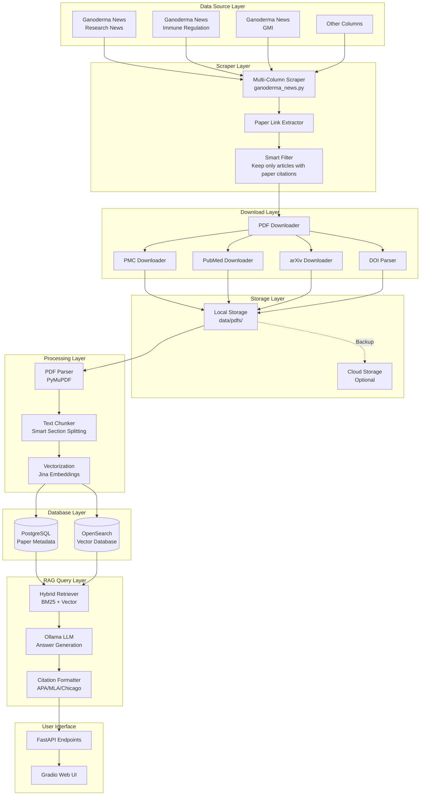
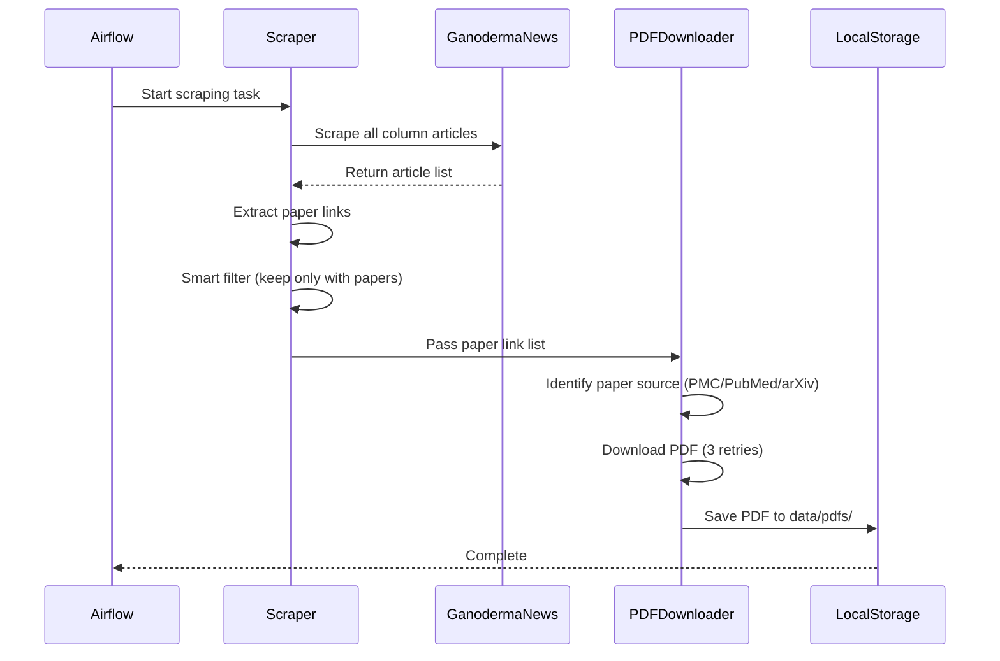
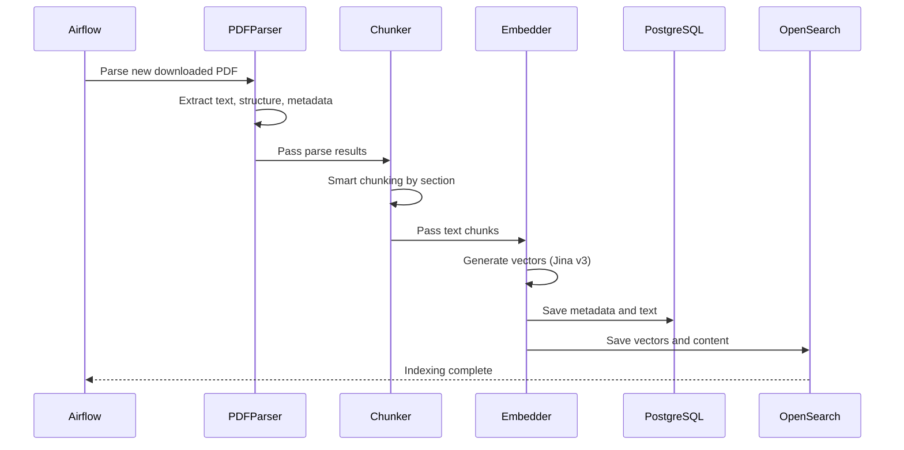
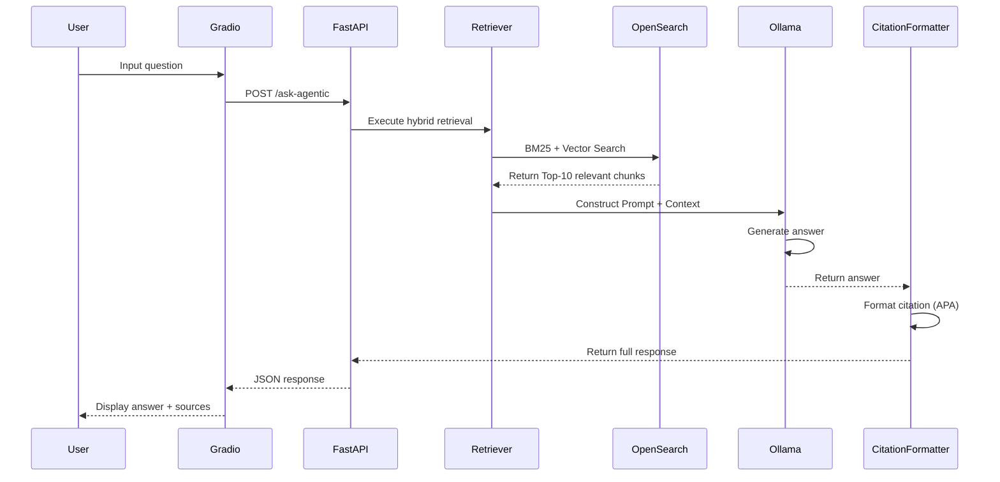

# Ganoderma Papers RAG System Overview

## 🎯 System Goal

Build an intelligent Ganoderma academic paper RAG system capable of:
- ✅ Automatically scraping academic papers from **all columns** of Ganoderma News
- ✅ Downloading and parsing PDF documents
- ✅ Providing professional Q&A service with literature citations

---

## 📊 Data Source Coverage

### Ganoderma News Column List

| Column Name | Content Type | Est. Articles | Paper Citation Rate |
|---------|---------|-----------|-----------|
| 🔬 **Research News** | Latest Academic Research | 150-200 | 95% |
| 🛡️ **Immune Regulation** | Immune Research | 50-80 | 80% |
| 🧬 **GMI** | GMI Protein Research | 30-50 | 90% |
| 📰 **News** | Industry News | 100-150 | 20% |
| 👥 **Ganoderma & Me** | User Stories | 50-80 | 10% |
| 📅 **Event Reports** | Event Reports | 40-60 | 5% |
| 📚 **Historical Review** | Historical Literature | 30-50 | 60% |

**Total**: Approx. 450-670 articles, with **300-400 containing academic paper citations**.

---

## 🏗️ System Architecture


```mermaid
graph TB
    subgraph "Data Source Layer"
        A1[Ganoderma News<br/>Research News]
        A2[Ganoderma News<br/>Immune Regulation]
        A3[Ganoderma News<br/>GMI]
        A4[Other Columns]
    end
    
    subgraph "Scraper Layer"
        B[Multi-Column Scraper<br/>ganoderma_news.py]
        C[Paper Link Extractor]
        D[Smart Filter<br/>Keep only articles with paper citations]
    end
    
    subgraph "Download Layer"
        E[PDF Downloader]
        F1[PMC Downloader]
        F2[PubMed Downloader]
        F3[arXiv Downloader]
        F4[DOI Parser]
    end
    
    subgraph "Storage Layer"
        G1[Local Storage<br/>data/pdfs/]
        G2[Cloud Storage<br/>Optional]
    end
    
    subgraph "Processing Layer"
        H[PDF Parser<br/>PyMuPDF]
        I[Text Chunker<br/>Smart Section Splitting]
        J[Vectorization<br/>Jina Embeddings]
    end
    
    subgraph "Database Layer"
        K[(PostgreSQL<br/>Paper Metadata)]
        L[(OpenSearch<br/>Vector Database)]
    end
    
    subgraph "RAG Query Layer"
        M[Hybrid Retriever<br/>BM25 + Vector]
        N[Ollama LLM<br/>Answer Generation]
        O[Citation Formatter<br/>APA/MLA/Chicago]
    end
    
    subgraph "User Interface"
        P[Gradio Web UI]
        Q[FastAPI Endpoints]
    end
    
    A1 --> B
    A2 --> B
    A3 --> B
    A4 --> B
    B --> C
    C --> D
    D --> E
    E --> F1
    E --> F2
    E --> F3
    E --> F4
    F1 --> G1
    F2 --> G1
    F3 --> G1
    F4 --> G1
    G1 -.Backup.-> G2
    G1 --> H
    H --> I
    I --> J
    J --> K
    J --> L
    K --> M
    L --> M
    M --> N
    N --> O
    O --> Q
    Q --> P
```

---

## 💾 Storage Planning

### Detailed Estimation

#### 1. PDF File Storage
```
Assumptions:
- Total articles: 450-670
- With paper citations: 300-400 (approx. 60%)
- Successfully downloaded PDF: 200-300 (approx. 70%)
- Avg PDF size: 3 MB

Calculation:
300 papers × 3 MB = 900 MB ≈ 1 GB
```

#### 2. Database Storage
```
PostgreSQL:
- Paper Metadata: 300 papers × 50 KB = 15 MB
- Text Chunks: 300 papers × 8 chunks × 20 KB = 48 MB
- Indexes and others: approx. 50 MB
Total: approx. 113 MB ≈ 120 MB
```

#### 3. Vector Database
```
OpenSearch:
- Vector Data: 2,400 chunks × 1024 dim × 4 bytes = 9.8 MB
- Text Content: 2,400 chunks × 20 KB = 48 MB
- Index Structure: approx. 200 MB
Total: approx. 258 MB ≈ 300 MB
```

#### 4. Docker Containers
```
- PostgreSQL Image: approx. 400 MB
- OpenSearch Image: approx. 800 MB
- Redis Image: approx. 50 MB
- Ollama + Model: approx. 5 GB
- Application Image: approx. 500 MB
Total: approx. 6.75 GB
```

### 📦 Total Storage Requirement

| Item | Size | Description |
|------|------|------|
| PDF Files | 1 GB | Original Papers |
| PostgreSQL | 120 MB | Metadata and Text |
| OpenSearch | 300 MB | Vectors and Indexes |
| Docker Containers | 6.75 GB | System Images |
| **Total** | **Approx 8.2 GB** | **Complete System** |

> [!NOTE]
> **Usage Recommendations**
> - 💻 **Local Development**: 8-10 GB disk space sufficient
> - 🚀 **Production**: Recommend reserving 15-20 GB (incl. logs and backups)
> - ☁️ **Cloud Storage**: Not currently needed, local storage is sufficient

---

## 🔄 Data Processing Flow

### Phase 1: Data Ingestion (Weekly)


```mermaid
sequenceDiagram
    participant Airflow
    participant Scraper
    participant GNews as GanodermaNews
    participant Downloader as PDFDownloader
    participant Storage as LocalStorage
    
    Airflow->>Scraper: Start scraping task
    Scraper->>GNews: Scrape all column articles
    GNews-->>Scraper: Return article list
    Scraper->>Scraper: Extract paper links
    Scraper->>Scraper: Smart filter (keep only with papers)
    Scraper->>Downloader: Pass paper link list
    Downloader->>Downloader: Identify paper source (PMC/PubMed/arXiv)
    Downloader->>Downloader: Download PDF (3 retries)
    Downloader->>Storage: Save PDF to data/pdfs/
    Storage-->>Airflow: Complete
```

### Phase 2: Data Processing (Sequential)


```mermaid
sequenceDiagram
    participant Airflow
    participant Parser as PDFParser
    participant Chunker
    participant Embedder
    participant DB as PostgreSQL
    participant OS as OpenSearch
    
    Airflow->>Parser: Parse new downloaded PDF
    Parser->>Parser: Extract text, structure, metadata
    Parser->>Chunker: Pass parse results
    Chunker->>Chunker: Smart chunking by section
    Chunker->>Embedder: Pass text chunks
    Embedder->>Embedder: Generate vectors (Jina v3)
    Embedder->>DB: Save metadata and text
    Embedder->>OS: Save vectors and content
    OS-->>Airflow: Indexing complete
```

### Phase 3: User Query (Real-time)


```mermaid
sequenceDiagram
    participant User
    participant Gradio
    participant API as FastAPI
    participant Retriever
    participant OS as OpenSearch
    participant LLM as Ollama
    participant Formatter as CitationFormatter
    
    User->>Gradio: Input question
    Gradio->>API: POST /ask-agentic
    API->>Retriever: Execute hybrid retrieval
    Retriever->>OS: BM25 + Vector Search
    OS-->>Retriever: Return Top-10 relevant chunks
    Retriever->>LLM: Construct Prompt + Context
    LLM->>LLM: Generate answer
    LLM-->>Formatter: Return answer
    Formatter->>Formatter: Format citation (APA)
    Formatter-->>API: Return full response
    API-->>Gradio: JSON response
    Gradio-->>User: Display answer + sources
```

---

## 🎨 User Interface Preview

### Gradio Interface Features

```
┌─────────────────────────────────────────────────────────┐
│  🍄 Ganoderma Academic Paper Smart Q&A System            │
├─────────────────────────────────────────────────────────┤
│                                                         │
│  📝 Please enter your question:                          │
│  ┌───────────────────────────────────────────────────┐  │
│  │ What are the therapeutic effects of Ganoderma...    │  │
│  └───────────────────────────────────────────────────┘  │
│                                                         │
│  [🔍 Submit Query]  [🔄 Clear]                           │
│                                                         │
├─────────────────────────────────────────────────────────┤
│  💬 Answer:                                              │
│  ┌───────────────────────────────────────────────────┐  │
│  │ According to Pakravan et al. (2024) in Frontiers  │  │
│  │ in Dentistry, gel containing 5% Ganoderma extract │  │
│  │ can effectively improve denture stomatitis...     │  │
│  └───────────────────────────────────────────────────┘  │
│                                                         │
├─────────────────────────────────────────────────────────┤
│  📚 References (3 papers)                                │
│  ┌───────────────────────────────────────────────────┐  │
│  │ 1. Pakravan F, et al. (2024)                      │  │
│  │    Antifungal Efficacy of Ganoderma lucidum...    │  │
│  │    [📄 View PDF] [🔗 Original Link]                │  │
│  │                                                   │  │
│  │ 2. Chen X, et al. (2023)                          │  │
│  │    Anti-inflammatory effects of...                │  │
│  │    [📄 View PDF] [🔗 Original Link]                │  │
│  └───────────────────────────────────────────────────┘  │
│                                                         │
└─────────────────────────────────────────────────────────┘
```

---

## 🚀 Deployment Options

### Option 1: Local Deployment (Recommended)

**Pros**:
- ✅ Completely free
- ✅ Data privacy
- ✅ Fast access
- ✅ Offline available

**Requirements**:
- Windows 10/11
- 16 GB RAM (Recommended)
- 20 GB Disk Space
- Docker Desktop

**Start Command**:
```bash
cd D:\anti test\ganoderma-papers-rag
docker-compose up -d
```

### Option 2: Hybrid Deployment

**Local**:
- PDF Files
- PostgreSQL
- OpenSearch

**Cloud**:
- Gradio Interface (Hugging Face Spaces)
- API Service (Railway / Render)

### Option 3: Full Cloud (Future Expansion)

**Scenarios**:
- Public sharing required
- Collaborative use
- Data volume > 50 GB

**Cloud Service Recommendations**:
- **PDF Storage**: AWS S3 / Google Cloud Storage
- **Database**: AWS RDS / Google Cloud SQL
- **Vector Database**: Pinecone / Weaviate Cloud
- **LLM**: OpenAI API / Anthropic Claude

---

## 📈 System Performance Estimation

| Metric | Estimate | Description |
|------|--------|------|
| Paper Count | 200-300 | Successfully downloaded PDFs |
| Chunk Count | 1,600-2,400 | Avg 8 chunks per paper |
| Query Latency | 2-5 sec | Retrieval + Generation |
| Retrieval Accuracy | 85-90% | Top-10 Relevance |
| Answer Quality | High | Based on actual paper content |

---

## 🔧 Future Optimization Directions

1. **Multi-modal Support**
   - Extract charts and tables from papers
   - Visualize research results

2. **Auto Summarization**
   - Generate summaries for each paper
   - Key finding extraction

3. **Knowledge Graph**
   - Build citation relationships between papers
   - Research topic evolution analysis

4. **Trend Analysis**
   - Popular Ganoderma research topics
   - Time series analysis

5. **Multi-language Support**
   - Support English queries
   - Bilingual answers

---

## ✅ Next Steps

1. **Confirm Requirements**: Ensure system design meets your needs
2. **Start Building**: Create project directory and infrastructure
3. **Develop Scraper**: Implement multi-column scraper
4. **Test & Verify**: Ensure data quality
5. **Deploy**: Start full system

---

> [!TIP]
> **Recommend starting small**
> 1. First scrape "Research News" (approx. 150 papers)
> 2. Verify system works
> 3. Gradually add other columns
> 4. This allows seeing results faster and easier debugging!
